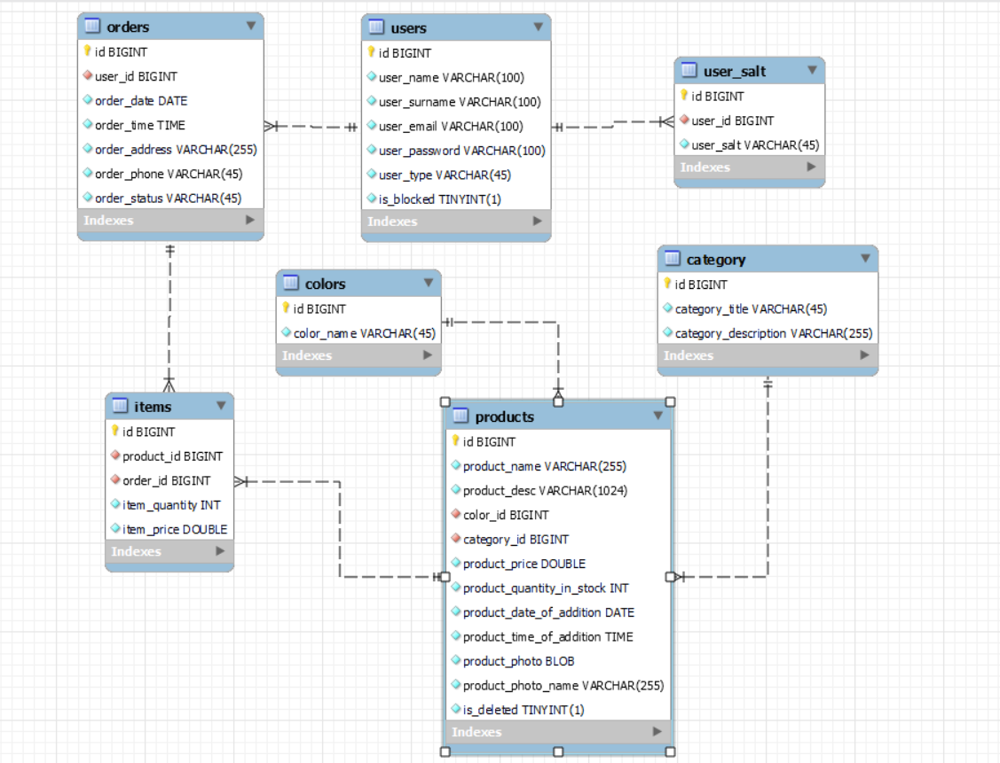

# Internet Shop

## Contents
+ [Overview](#Overview) 
+ [Use cases](#Use-cases)
+ [Used Technologies](#Used-Technologies) 
+ [Project structure](#Project-structure)
+ [Application startup](#Application-startup)

## Overview
Internet shop is a web application that can be used to buy and sell goods. The shop has a catalog of products.
The user browses the catalog and can add items to their cart. After adding the goods to the
cart, the registered user can place an order. This option is not available for an unregistered
user. After placing an order, it (order) recieves the status "registered".

The user has a personal account where he can view his orders.

The system administrator has the rights of:
* Adding / removing goods, changing product information;
* Blocking / unblocking- the user;
* Transfering order from "registered" to "paid"; or "canceled".

## Use cases
When you enter the application website you enter like a guest and you have access only to these actions:
* Login as a user
* Register a new user
* View product catalog
* Sort by product name (az, za)
* Sort of goods by price (from cheap to expensive, from expensive to cheap)
* Sorting goods by novelty
* Sample of goods by parameters (category, price range, color)
* Add products to cart

When you will log in as a normal user you could perform these additional actions:
* View your user info
* Place an order
* View all your orders in your personal account

When you will log in as an admin, you will have the rights to:
* View all users data;
* Add / remove goods, change product information;
* Block / unblock- the user;
* Transfer order from "registered" to "paid"; or "canceled".

## Used Technologies
* Apache Tomcat (v9.0)
* MySQL
* JDBC
* HttpServlet, HttpFilter, ServletContextListener
* HTML, CSS, JSP, JSTL
* Maven
* JUnit
* Mockito
* Log4J

## Project structure
Project implemented refers to an n-tier structure and has 4 layers:

1. Data access layer (DAO)
1. Application layer (service)
1. Presentation layer (Front Controller)
1. View layer

Table relations 

## Application startup

1. Configure Apache Tomcat(or another servlet container) for your IDE
1. Install MySQL
1. Create a database by using the SQL queries from the `init_db.sql` file, located in `/MyInternetShop/src/main/resources`
1. Change `username`, `password` and `url` values in the `/MyInternetShop/src/main/webapp/META-INF/context.xml` to open a connection with your database
1. Launch application and start using it at `http://localhost:%your_port%/MyInternetShop`